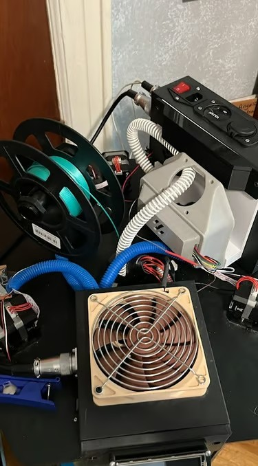
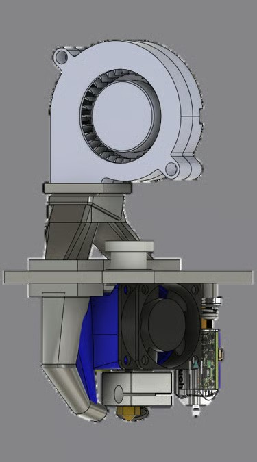
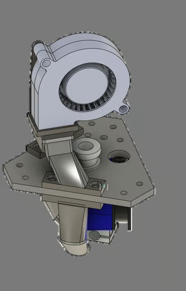
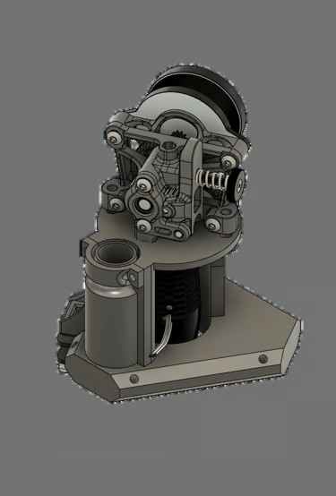
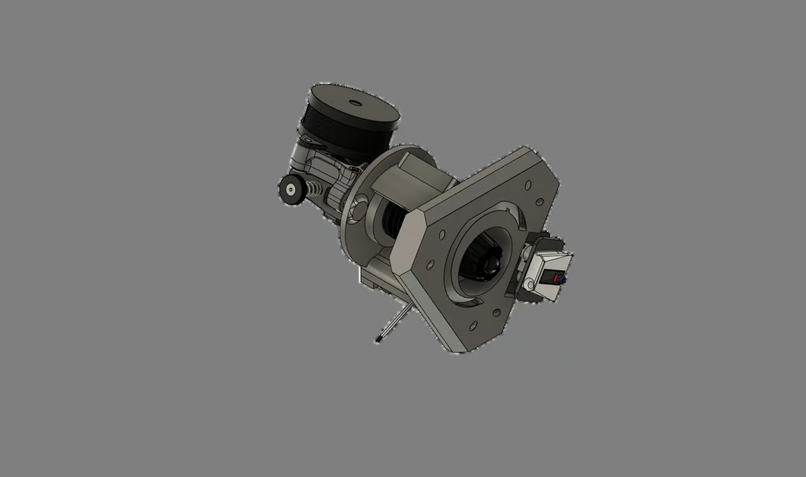
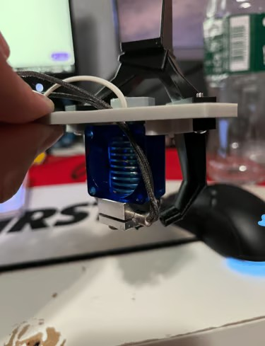
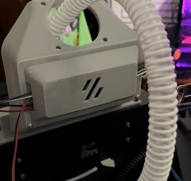

# Delta 3D Printer

### High-speed delta kinematic machine with closed-loop steppers and CPAP toolhead cooling

  
  

An experimental high-speed delta 3D printer built on a modified TEVO Little Monster chassis featuring three generations of custom lightweight toolheads.

[Project Overview](#project-overview) | [Effector Evolution](#effector-evolution) | [CPAP Cooling](#cpap-cooling-system) | [Closed-Loop Motion](#closed-loop-stepper-motors) | [Configurations](code/) | [Back to Lab](../)

---

## Project Overview

Built during the summer of 2023, this machine explored the limits of non-planar delta kinematics. By pairing encoder-feedback closed-loop NEMA 17 steppers with a high-flow remote-blower toolhead, the goal was rapid acceleration and artifact-free extrusion.

| Machine Specification | Configuration & Details |
| --- | --- |
| Kinematic type | Non-Cartesian parallel 3-arm delta |
| Base chassis | Modified TEVO Little Monster aluminum extrusion frame |
| Build volume | Circular heated bed, ~340 mm diameter × 500 mm height |
| Motion drive | NEMA 17 closed-loop stepper motors with magnetic encoder feedback |
| Part cooling | Off-gantry remote 12V/24V CPAP high-static-pressure blower |
| Control & firmware | Klipper on Linux with KlipperScreen TFT35 interface |
| Bed heating | 110 V AC silicone heater switched via solid-state relay (SSR) |
| Current status | Fully tested, documented, and retired |

## Effector Evolution

### 01 / Effector V1 (Bowden Test)

The initial version prioritized minimum moving mass by employing a long Bowden tube and a 5015 blower fan.

  
  

- **Limitation:** Bowden tube friction caused excessive hysteresis and retraction lag. Curved ducting restricted airflow from the 5015 fan.

---

### 02 / Effector V2 (Integrated Direct-Drive)

Integrated a high-flow direct-drive extruder, high-wattage melt zone, and auto bed-leveling probe mount directly into the effector frame.

  
  

- **Limitation:** Offset bed probe suffered from tilt errors during calibration. Airflow was insufficiently focused at the nozzle orifice.

---

### 03 / Effector V3 (Lowered Center of Mass)

Inverted the hotend mounting to lower the center of gravity and integrated precision 360° ring ducts. Replaced the offset probe with a removable nozzle-contact membrane switch for true zero-offset bed probing.

## CPAP Cooling System

Moving the part-cooling blower off the effector entirely eliminated reciprocating toolhead mass. A high-pressure CPAP blower mounted to the upper frame delivers high-velocity air through a flexible silicone hose directly into the toolhead nozzles.

  
  

## Closed-Loop Stepper Motors

Each delta tower is driven by a NEMA 17 closed-loop motor with an integrated magnetic encoder. The onboard PCB compares step commands with absolute shaft rotation, correcting positional deviations in real time and completely eliminating layer shifts at high accelerations.

## Touchscreen Interface

A BigTreeTech TFT35 running KlipperScreen is mounted on an adjustable 75° articulated bracket on the electronics enclosure, providing complete local calibration, temperature, and macro controls.

---

Designed and built by **[Angelo James Demetroulakos](https://github.com/AloeVeraZ)** · **[3D Printer Lab](../)**

