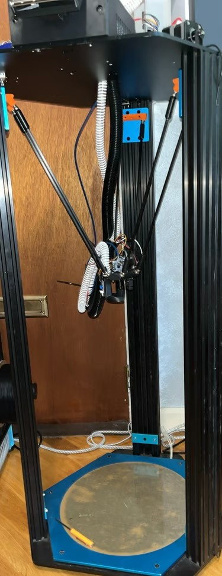

<div align="center">

# 3D Printer Lab

### Custom machines · tuned firmware · documented builds

<p>
  <a href="ZeroG/"></a>
  <a href="Delta/"></a>
  <a href="Voron%20V0.2990/"></a>
</p>

<p>
  
  
  
  <a href="LICENSE"></a>
</p>

Firmware configurations, slicer profiles, build history, and original photography from a collection of heavily modified and custom-built 3D printers.

**[Explore the builds](#featured-machines) · [Browse every configuration](#configuration-library) · [Read the license](#license--attribution)**

</div>

---

## Featured machines

<table>
  <tr>
    <td width="42%">
      <a href="ZeroG/"></a>
    </td>
    <td width="58%" valign="top">
      <h3>ZeroG Hydra</h3>
      <p><strong>Large-format CoreXY · quality-first · sensor-rich</strong></p>
      <p>A custom Mercury/Hydra build designed around a large build volume, automated calibration, and repeatable print quality instead of chasing speed alone.</p>
      <ul>
        <li>Three-point floating bed with automatic tramming</li>
        <li>Beacon eddy-current probing and accelerometer</li>
        <li>Filament monitoring, cutter, LEDs, and toolhead display</li>
        <li>Phaetus Rapido hotend and Clockwork 2 extruder</li>
      </ul>
      <p><strong><a href="ZeroG/">Build story + gallery →</a></strong> &nbsp; <strong><a href="ZeroG/code/">Configuration files →</a></strong></p>
    </td>
  </tr>
</table>

<table>
  <tr>
    <td width="58%" valign="top">
      <h3>Delta 3D Printer</h3>
      <p><strong>Closed-loop motion · custom effector · CPAP cooling</strong></p>
      <p>An experimental high-speed delta built from a TEVO Little Monster frame and developed through three generations of custom effectors.</p>
      <ul>
        <li>NEMA 17 closed-loop steppers with encoder feedback</li>
        <li>Remote CPAP blower for lightweight part cooling</li>
        <li>Direct-drive extrusion and nozzle-mounted probing</li>
        <li>Pivoting TFT35 interface running KlipperScreen</li>
      </ul>
      <p><strong><a href="Delta/">Build story + gallery →</a></strong> &nbsp; <strong><a href="Delta/code/">Configuration files →</a></strong></p>
    </td>
    <td width="42%">
      <a href="Delta/"></a>
    </td>
  </tr>
</table>

<table>
  <tr>
    <td width="42%">
      <a href="Voron%20V0.2990/"></a>
    </td>
    <td width="58%" valign="top">
      <h3>Voron V0.2990</h3>
      <p><strong>High-speed V0.2R1 · custom high-flow toolhead · serviceable electronics</strong></p>
      <p>A serialized Voron V0.2R1 pushed beyond its stock configuration with custom cooling, filtration, monitoring, lighting, and electronics mounts.</p>
      <ul>
        <li>225–350 mm/s printing and up to 650 mm/s travel</li>
        <li>Custom high-flow toolhead and auxiliary cooling</li>
        <li>Active carbon filtration and chamber monitoring</li>
        <li>Camera automation, runout sensing, and hinged electronics access</li>
      </ul>
      <p><strong><a href="Voron%20V0.2990/">Build story + gallery →</a></strong> &nbsp; <strong><a href="Voron%20V0.2990/code/">Configuration files →</a></strong></p>
    </td>
  </tr>
</table>

---

## Configuration library

Every machine keeps firmware, macros, board variants, and slicer profiles inside its own `code` directory.

| Project | What's included | Files |
|:--|:--|--:|
| **[ZeroG Hydra](ZeroG/)** | Klipper configuration, macros, Beacon setup, RGB control, adaptive bed mesh, and OrcaSlicer profile | 6 |
| **[Delta 3D Printer](Delta/)** | Four printer revisions covering TMC2209 and closed-loop motor setups, plus sample macros | 5 |
| **[Voron V0.2990](Voron%20V0.2990/)** | Fly Gemini V3 and BTT M8P configurations, modular Klipper files, and OrcaSlicer profile | 17 |
| [SnakeOil KP3S](SnakeOil-Kp3s/code/) | Modular Klipper configuration for motion, extrusion, probing, fans, and thermistors | 9 |
| [CitytechClay](CitytechClay/code/) | Clay-printer configuration, extrusion, pump, macro, and timelapse files | 5 |
| [RatRig V-Core 3 500](RatRig%20V-Core%203%20500/code/) | Printer configuration and OrcaSlicer profile | 2 |
| [Justin Voron 2.4](Justin%20Voron%202.4/code/) | Stock and modified printer configurations | 2 |
| [Testbench](testbench/code/) | Minimal development configuration | 1 |

<details>
<summary><strong>Repository layout</strong></summary>

```text
3DPrinters/
├── ZeroG/
│   ├── README.md       # Build story and gallery
│   ├── images/         # Archived project photography
│   └── code/           # Klipper + OrcaSlicer files
├── Delta/
│   ├── README.md
│   ├── images/
│   └── code/
├── Voron V0.2990/
│   ├── README.md
│   ├── images/
│   └── code/
└── other printers/
    └── code/           # Machine-specific configurations
```

</details>

## Before using a configuration

> [!CAUTION]
> These files were written for specific custom machines. Do not copy a configuration directly to another printer without checking its hardware.

At minimum, verify:

- MCU pin assignments and stepper direction
- Thermistor and temperature-sensor types
- Heater limits, power control, and thermal protection
- Bed dimensions, axis limits, and homing behavior
- Stepper currents, microsteps, rotation distances, and gearing
- Probe offsets, safe Z movement, and emergency shutdown behavior

## License & attribution

This repository is licensed under the **[Creative Commons Attribution 4.0 International License](LICENSE)**.

You may copy, redistribute, remix, transform, and build upon this work—including for commercial use—as long as you provide appropriate credit, link to the license, and clearly indicate whether you made changes.

Suggested attribution:

> **3D Printer Projects** by [AloeVeraZ](https://github.com/AloeVeraZ), licensed under [CC BY 4.0](https://creativecommons.org/licenses/by/4.0/). Changes were made to the original material.

If you redistribute the work unchanged, remove the final sentence. Third-party projects, trademarks, and linked resources remain the property of their respective owners.

---

<div align="center">

Built, modified, tuned, photographed, and documented by **[AloeVeraZ](https://github.com/AloeVeraZ)**.

</div>
