

# Voron V0.2990

### High-speed Voron V0.2R1 with custom high-flow toolhead, active filtration, and modular electronics

<picture>
  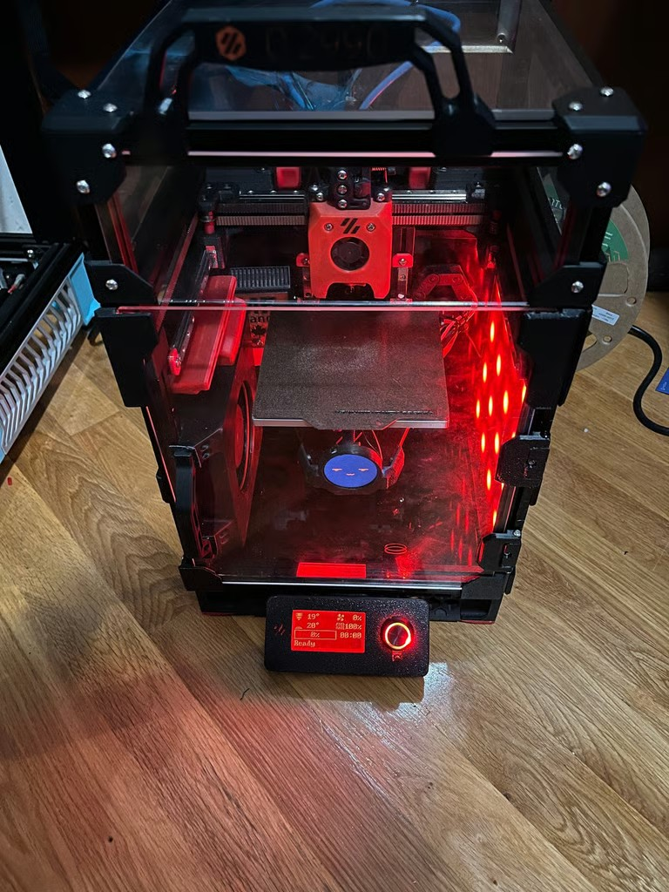
</picture>

A serialized, heavily upgraded Voron V0.2R1 CoreXY platform tuned for 225–350 mm/s print speeds and 650 mm/s travel moves.

[Project Overview](#project-overview) | [Custom Toolhead](#custom-toolhead) | [Chamber Systems](#auxiliary-cooling-fan) | [Electronics & Mounting](#electronics-din-rail-mount) | [Configurations](code/) | [Back to Lab](../)

---

## Project Overview

Sourced from raw components according to the Voron design manual, V0.2990 was extensively customized to eliminate thermal and mechanical bottlenecks. The modifications below enable high-volumetric-flow printing in enclosed engineering materials.

| Machine Specification | Configuration & Details |
| --- | --- |
| Kinematic type | CoreXY enclosed micro-format |
| Build volume | 120 × 120 × 120 mm |
| Print speeds | 225–350 mm/s print velocity, 650 mm/s rapid travel |
| Motherboards | Fly Gemini V3 & BigTreeTech M8P configurations |
| Toolhead | Custom lightweight 3D-printed direct-drive assembly |
| Filtration & air | Activated carbon recirculation filter + 12032 auxiliary bed fan |
| User interface | BTT Mini12864 LCD screen + web interface webcam stream |
| Serial registration | V0.2990 |

## Custom Toolhead

To support high travel speeds without volumetric starvation, a custom direct-drive toolhead was engineered with an enlarged melt zone hotend and high-torque geared extruder. The assembly increases filament grip and thermal transfer while maintaining low moving mass.

  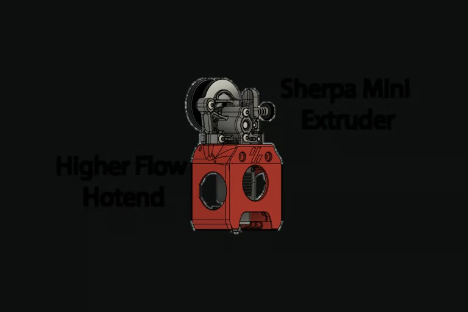

## Auxiliary Cooling Fan

A high-output 12032 grille fan mounted adjacent to the bed provides supplementary cross-flow part cooling for high-speed overhangs without burdening the gantry with heavy blower fans.

  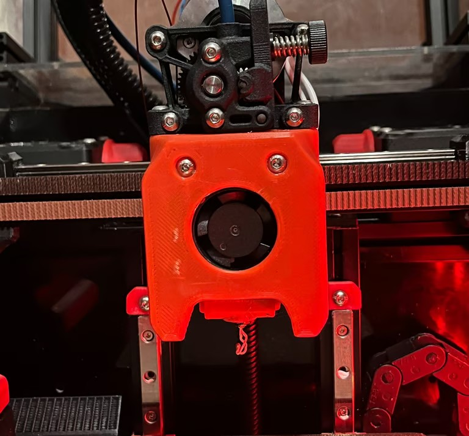

## Active Carbon Filter

An onboard Nevermore-style chamber circulation system pulls internal air through activated carbon pellets using a 5015 blower, capturing styrene and VOC emissions when printing ABS/ASA filaments.

  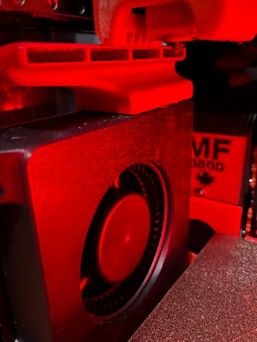

## Sensors & Monitoring

| System | Component | Purpose |
| --- | --- | --- |
| Chamber thermistor | Reclaimed NTC 100K probe | Positioned at frame apex for accurate enclosed temperature tracking |
| AI Camera Mount | Internal USB camera | Integrates with web interface for automated timelapse and failure detection |
| Filament monitor | Dual encoder/switch sensor | Tracks presence and real-time feed rate to catch jams and runouts |

| Chamber Temperature Sensor | Camera Mount & AI Integration | Filament Runout Sensor |
| :---: | :---: | :---: |
| 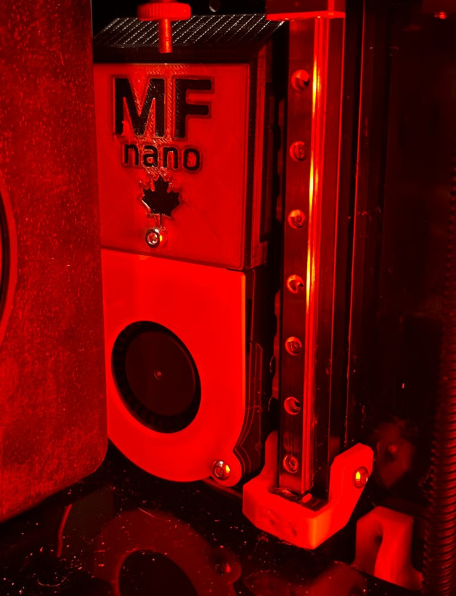 | 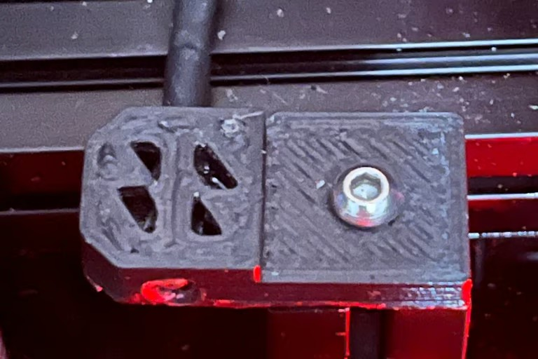 | 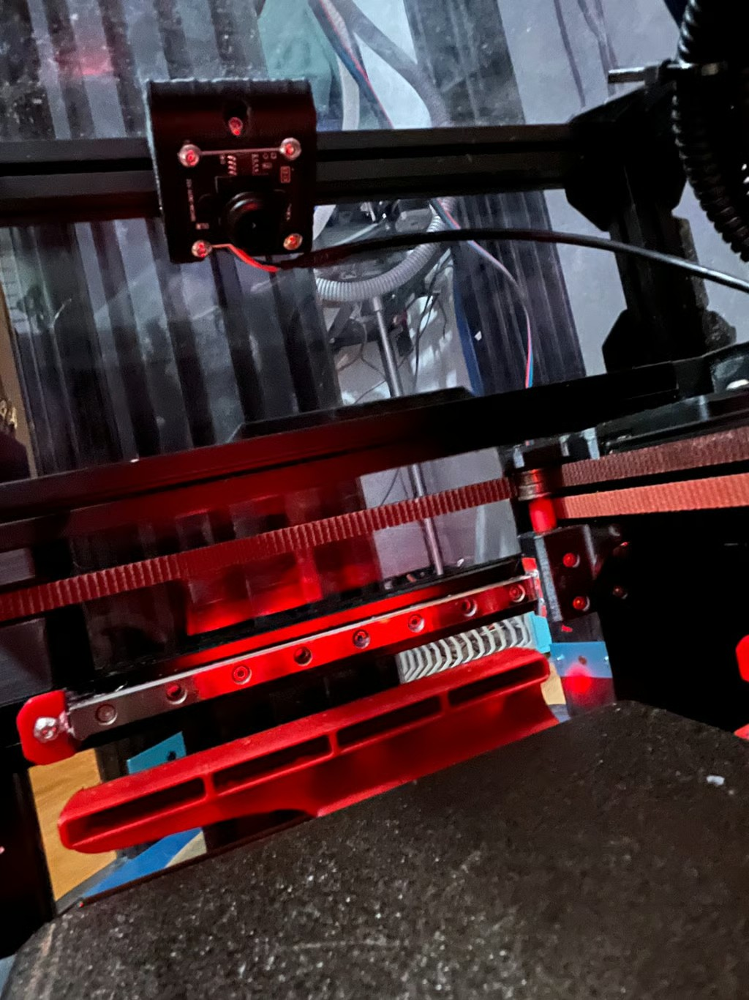 |

## Enclosure & Serviceability

- **Reinforced Door Hinges:** Modified from Leiwandizer's design to utilize M3 heat-set inserts as load-bearing pivot pins.
- **Smoked Acrylic & Diffused RGB:** Integrated side-panel lighting for optimal contrast on camera streams.
- **Mini12864 V2.0 Screen Bracket:** Custom under-door enclosure mount for quick physical menu navigation.

| RGB Panel Design | Assembled RGB Panel | Mini12864 Display Mount |
| :---: | :---: | :---: |
| 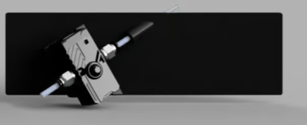 | 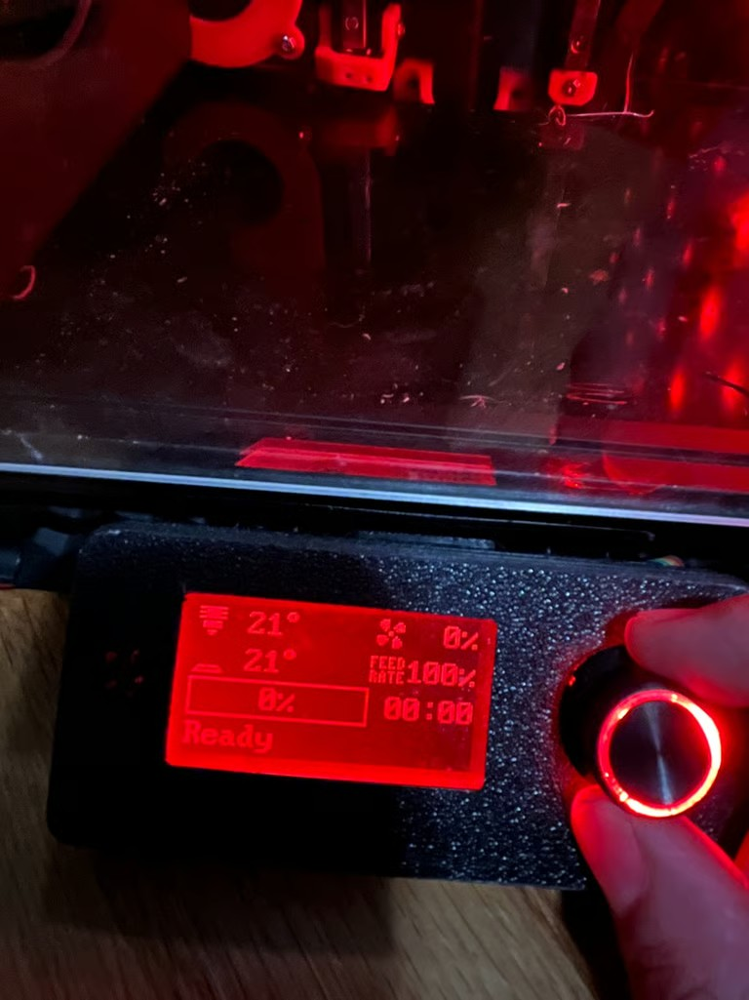 | 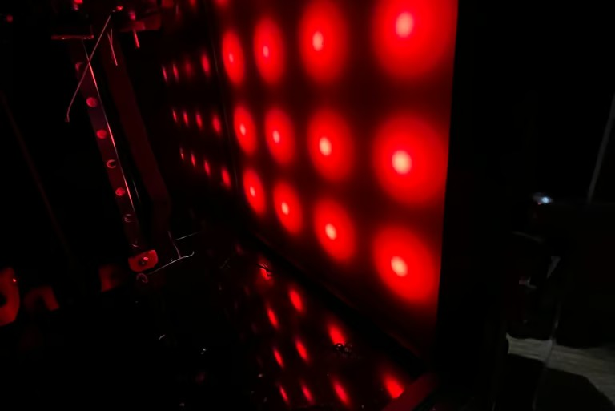 |

## Electronics DIN Rail Mount

A custom rear-extrusion DIN rail bracket secures non-standard motherboards and stepper drivers. A hinged rear service door with a dedicated Noctua cooling fan enables rapid electronics access without dismantling the frame.

| DIN Rail CAD Render | Electronics Bay Layout | Hinged Rear Service Door |
| :---: | :---: | :---: |
| 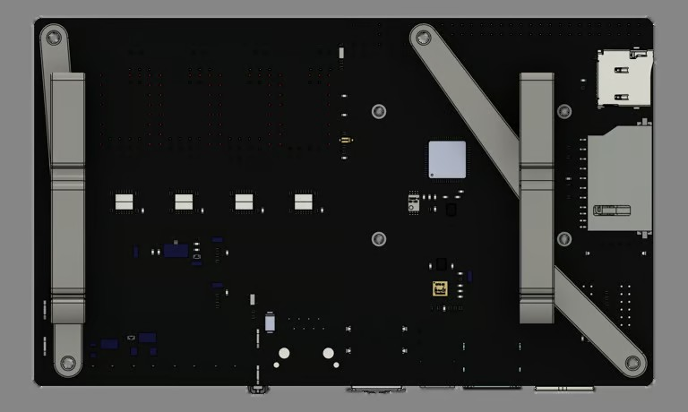 | 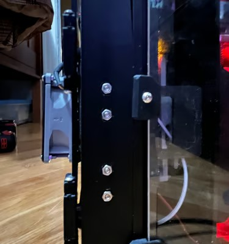 | 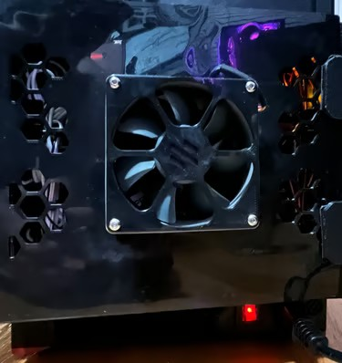 |

---

Built, modified, and tuned by **[Angelo James Demetroulakos](https://github.com/AloeVeraZ)** · **[3D Printer Lab](../)**

