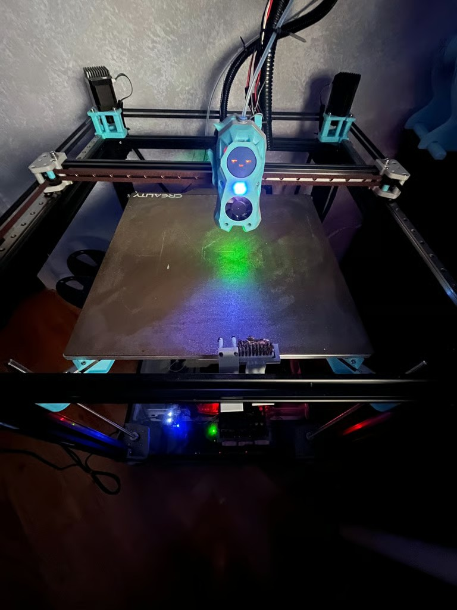
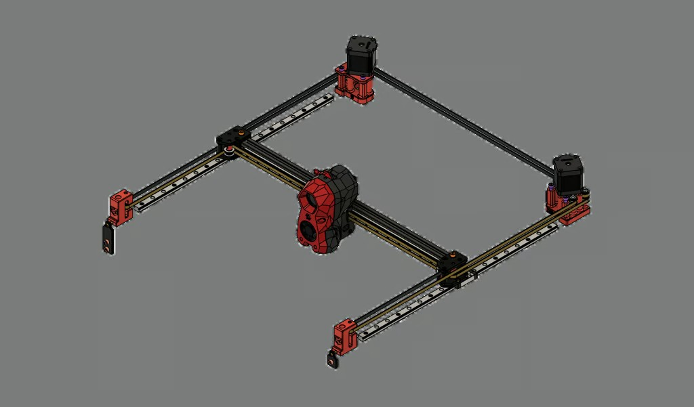
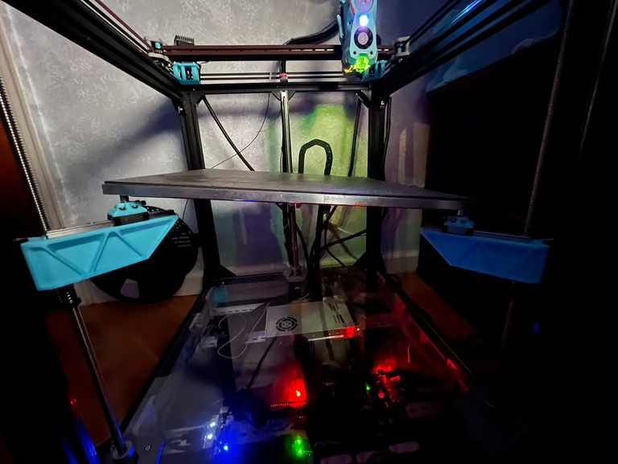
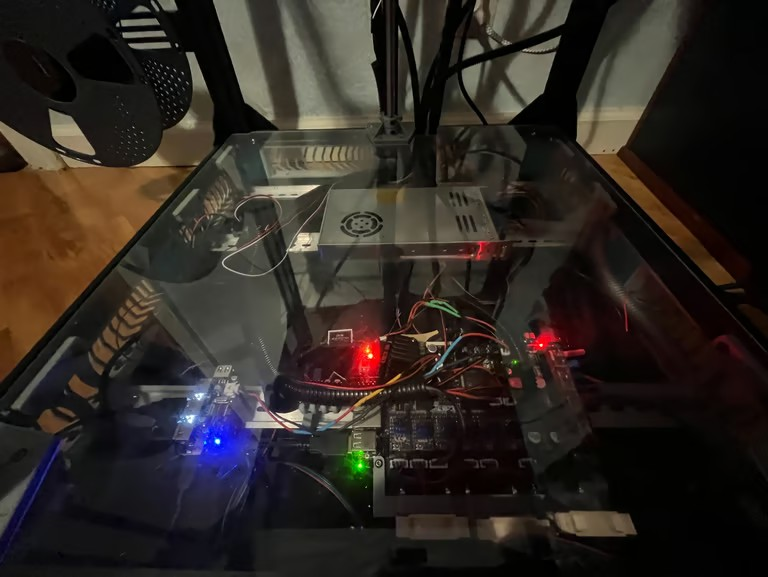
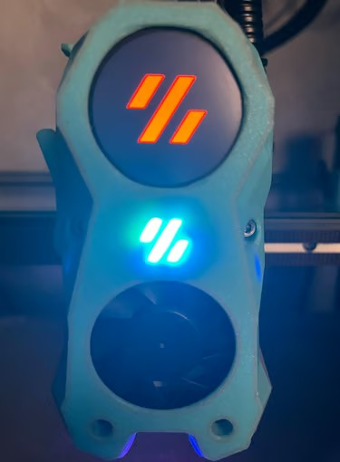
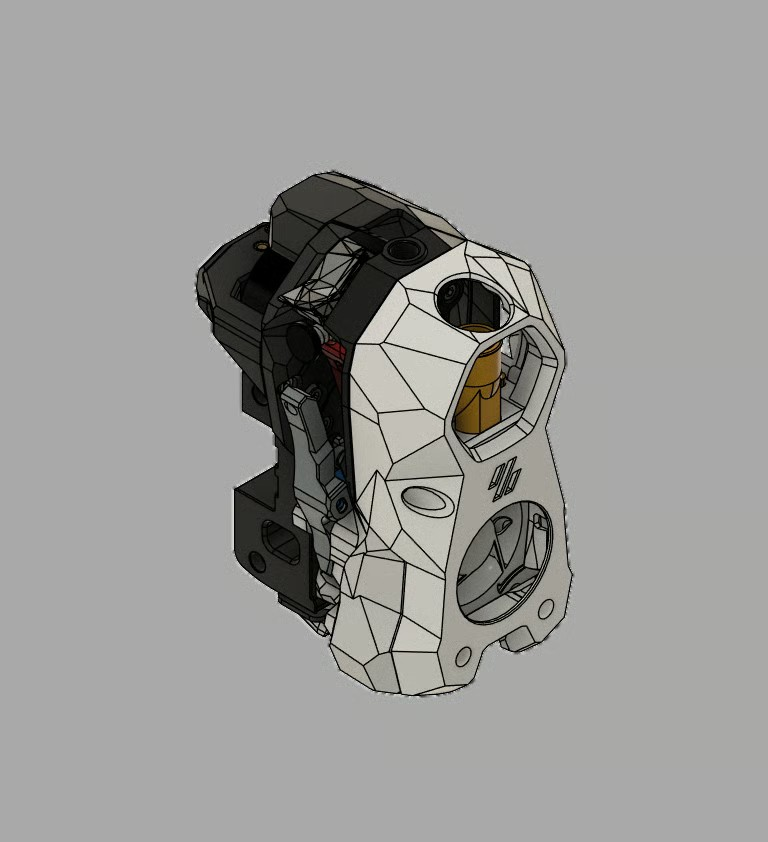
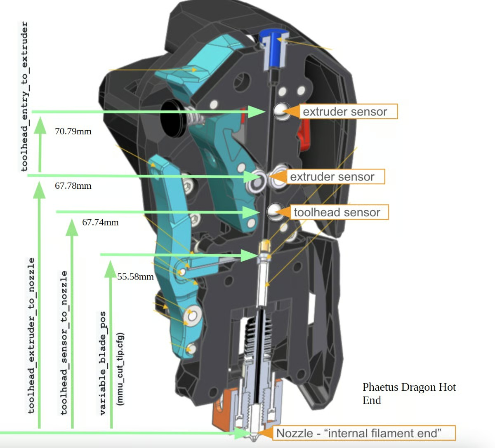
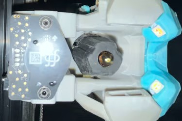

# ZeroG Hydra

[Browse the printer configuration and OrcaSlicer profile](code/)

## Overview

After building two 3D printers from raw materials and using countless off-the-shelf options, I noticed I needed a reliable machine with a big build volume. When building this machine I did not want to focus on speed. The other machines I have built are extremely fast but cannot print quality parts. This machine was built to make quality parts instead. I can achieve this through the use of many sensors within the toolhead. The hotend and extruder were picked due to their ability to make quality prints.

**Status:** This project is finished.

## CoreXY motion system

Since reliability and speed are my top priority, I decided to use a CoreXY motion system. This motion system uses two motors to move the X and Y axes together. This allows for faster print speeds and precise movement when the belts are tensioned properly. Unlike most motion systems, the motors are always stationary, leading to less mass along the Y axis. Because of this, CoreXY printers can move much faster than many other motion systems.

## "Floating" bed assembly

To allow this printer to be mostly automated, the bed needs to pivot along three points. The three points are independent, which allows the firmware to zero all three sides automatically. This is essential for allowing the printer to perform bed leveling and tramming on its own.

## Electronics bay

The electronics bay is directly below the printer's build area. It holds a USB splitter, mainboard, power supply, and solid-state relay (SSR). All of the electronics that make the printer work are located within the ventilated bay.

The mainboard controls the printer by communicating with its sensors, heating elements, USB splitter, and SSR. The SSR is responsible for bed heating and allows the bed to run on 110 volts instead of the standard 24 volts output by the mainboard. The USB splitter lets the printer communicate with the bed-leveling sensor PCB. The power supply is a standard 24 V, 350 W Ender 3 PSU. The printer runs Klipper on Linux.

  
  

## Modernized toolhead

The toolhead is based on [Filametrix](https://github.com/sorted01/Filametrix). It has two filament sensors and a knife for filament monitoring and cutting, an eddy-current bed-leveling system, LED lights, and a touchscreen, along with the standard blower fans, hotend, and extruder.

The filament sensors allow the printer to know whether filament is passing through the toolhead and where it is inside the assembly. The bed-leveling sensor lets the printer scan the bed and use nozzle probing for a precise Z offset. The LEDs and touchscreen display messages about print progress. All of these features improve ease of use. The hotend is a Phaetus Rapido and the extruder is a [Clockwork 2](https://github.com/VoronDesign/Voron-Stealthburner/tree/main).

  
  

## Toolhead sensors

The printhead uses two filament-monitoring sensors, consisting of limit switches, and a bed-leveling sensor. The two limit switches work together to ensure that filament is being fed into the hotend and has not snapped.

The first sensor is at the top of the extruder and is used as a general runout sensor. It is configured to pause prints whenever it does not detect filament. It can also be configured to detect whether filament is attempting to feed into the extruder, enabling multi-material printing. The second sensor is below the extruder and filament cutter. It is not used during normal printing, but is enabled for multi-material printing. It lets the printer confirm that filament was cut successfully: this sensor will still detect filament while the upper sensor will not once the filament is fully retracted.

The other sensor is a Beacon probe. It is used primarily for bed leveling but also doubles as an accelerometer. The sensor uses magnetic fields and eddy currents to detect its distance from the bed. This produces fast, accurate bed meshes. It also allows the nozzle to establish the printer's zero position for the first layer and when locating the three points on the bed.

  
  

